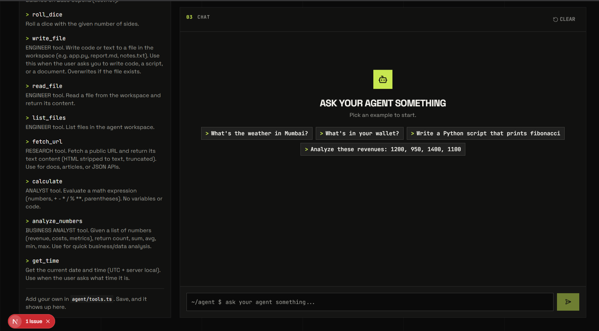

<div align="center">

# 🤖 Agentmaxxing — Azure OpenAI Agent Starter

**A Next.js AI agent with tools and its own crypto wallet, powered by Azure OpenAI.**

[](https://nextjs.org)
[](https://portal.azure.com)
[](https://www.typescriptlang.org)
[](https://viem.sh)
[](LICENSE)



*Setup guide, live tools list, and full-page chat showing every tool call and payment.*

</div>

---

## ✨ What is this?

A minimal starter for building **AI agents that call tools and pay for APIs with their own crypto wallet** — with **Azure OpenAI as the default (and only) AI provider**. No Gemini, no other keys needed.

You spend almost all of your time in **one file — `agent/tools.ts`** — where each tool is a plain TypeScript function the agent can decide to call.

## 🎁 What you get

| # | Feature |
|---|---------|
| 1 | Working agent loop (`agent/agent.ts`): sends chat + tools to Azure OpenAI, runs requested tools, returns the final answer |
| 2 | **10 built-in tools**: paid weather API, wallet, dice, file/code tools, web fetch, calculator, business analytics, clock |
| 3 | **3-in-1 persona** via system prompt: software engineer, businessman, data analyst |
| 4 | Agent wallet with x402-style signed payments for paid APIs |
| 5 | Mock paid weather API (`/api/weather`) that returns `402 Payment Required` until the agent pays |
| 6 | Full-page ChatGPT-style UI: guided setup, one-click wallet creation, chat with expandable tool-call inspector |

## 🧰 The 10 tools

| Tool | Persona | What it does |
|------|---------|--------------|
| `get_weather` | 💰 paid API | Weather for any city — costs 0.01 USDC, auto-paid from the agent wallet |
| `get_my_wallet` | 👛 wallet | Agent's own address + ETH balance on Base Sepolia testnet |
| `roll_dice` | 🎲 fun | Roll a dice with any number of sides |
| `write_file` | 👨‍💻 engineer | Write code or docs to `./workspace` (e.g. `app.py`, `report.md`) |
| `read_file` | 👨‍💻 engineer | Read a file back from `./workspace` |
| `list_files` | 👨‍💻 engineer | List files in the agent workspace |
| `fetch_url` | 🔍 research | Fetch any public URL, returned as stripped text |
| `calculate` | 📊 analyst | Safe math evaluation — the agent never guesses arithmetic |
| `analyze_numbers` | 💼 businessman | count / sum / avg / min / max over revenues, costs, metrics |
| `get_time` | 🕒 utility | Current date & time (UTC + server local) |

> File tools are sandboxed to `./workspace`, so the agent can write code freely without touching your app source.

## 🚀 Quickstart

### 1. Prerequisites

- **Node.js 20+** — check with `node -v`
- **An Azure OpenAI resource** — endpoint, API key, and a model deployment (e.g. `gpt-4o`).
  Find them in the [Azure portal](https://portal.azure.com) → your Azure OpenAI resource → *Keys and Endpoint* + *Model deployments*.

### 2. Configure credentials

```bash
copy .env.example .env
```

Open `.env` and fill in:

```bash
AZURE_OPENAI_ENDPOINT=https://your-resource.openai.azure.com/
AZURE_OPENAI_API_KEY=your_key_here
AZURE_OPENAI_DEPLOYMENT=gpt-4o
```

> Restart `npm run dev` after any `.env` change.

### 3. Install & run

```bash
npm install
npm run dev
```

Open [http://localhost:3000](http://localhost:3000).

### 4. Create the agent wallet

Click **Create wallet** in the Setup panel. It is saved to `.agent-wallet.json` (git-ignored, testnet only — never use real funds).

### 5. Chat with your agent 🎉

Try these:

- `What's the weather in Mumbai?` → calls the paid API, wallet pays automatically
- `What's in your wallet?` → reads its own address + balance
- `Write a Python script that prints fibonacci` → writes `./workspace/*.py` via `write_file`
- `Analyze these revenues: 1200, 950, 1400, 1100` → business stats via `analyze_numbers`

Click any tool entry above a reply to inspect exact input/output. The agent remembers context — use **Clear** to restart.

## 🛠️ Add your own tool

Open `agent/tools.ts` and append:

```ts
{
  name: "get_joke",
  description: "Get a random joke. Use when the user asks for humor.",
  parameters: { type: "object", properties: {} },
  run: async () => {
    const res = await fetch("https://official-joke-api.appspot.com/random_joke");
    return res.json();
  },
},
```

Save and refresh — it appears in the Tools panel instantly. Tips:

1. **Describe clearly** — the model reads `description` to decide *when* to call it.
2. **Return plain objects** (e.g. `{ temperature: 28 }`), not class instances.
3. **Keep tools small** — several focused tools beat one giant tool.
4. **Throw on failure** — the loop feeds the error back to the model, which explains or retries.

## 🧠 How it works

### The agent loop (`agent/agent.ts`)

```
you ──► Azure OpenAI (+ tool definitions) ──► tool call? ──► run tool ──► back to model (× up to 8 steps)
                                                    └─► plain text? ──► final answer
```

Built on the `openai` SDK's `AzureOpenAI` client with native function calling.

### Paying for an API (x402 pattern)

1. Agent requests `/api/weather` → API answers `402 Payment Required` + price/asset/recipient.
2. Agent wallet signs a payment message (`payAndFetch` in `agent/wallet.ts`).
3. Agent retries with the signed payment in the `X-PAYMENT` header.
4. API verifies the signature → `200 OK` + weather data.

Payments are cryptographically signed but **not submitted on-chain** — a demo, no real money moves.

## 📁 Project structure

| Path | Description |
|------|-------------|
| `agent/tools.ts` | ⭐ The tools — the file you'll edit most |
| `agent/agent.ts` | Azure OpenAI agent loop |
| `agent/wallet.ts` | Wallet + payment signing/verification |
| `app/page.tsx` | UI: setup steps, tools list, chat |
| `app/api/agent/route.ts` | Agent endpoint (Azure-backed) |
| `app/api/wallet/route.ts` | Create/read the agent wallet |
| `app/api/weather/route.ts` | Mock paid weather API |
| `workspace/` | Sandbox where the agent writes files (created on first use) |
| `public/image.png` | Dashboard screenshot used above |
| `.env` | Your Azure credentials (never committed) |
| `.agent-wallet.json` | Agent wallet (never committed) |

## ⚙️ Configuration

| Variable | Required | Default | Description |
|----------|----------|---------|-------------|
| `AZURE_OPENAI_ENDPOINT` | ✅ | — | e.g. `https://your-resource.openai.azure.com/` |
| `AZURE_OPENAI_API_KEY` | ✅ | — | Azure OpenAI key |
| `AZURE_OPENAI_DEPLOYMENT` | ✅ | — | Deployment name, e.g. `gpt-4o` |
| `AZURE_OPENAI_API_VERSION` | No | `2024-12-01-preview` | Azure OpenAI API version |
| `AZURE_OPENAI_REASONING_EFFORT` | No | `none` | Reasoning effort for reasoning models — keep `none` so function tools work (e.g. gpt-6-sol rejects tools otherwise) |
| `WALLET_PRIVATE_KEY` | No | — | Reuse an existing test wallet (`0x…`), overrides `.agent-wallet.json` |

## ❓ Troubleshooting

| Problem | Solution |
|---------|----------|
| Page asks for Azure credentials | Fill `.env`, restart `npm run dev` |
| Model/auth error in chat | Verify endpoint URL (trailing `/`), key, deployment name, API version |
| `Function tools with reasoning_effort are not supported` | Set `AZURE_OPENAI_REASONING_EFFORT=none` in `.env` (default), restart server |
| Agent ignores my new tool | Make `description` more specific about *when* to use it, restart server |
| Weather fails with "no wallet yet" | Click **Create wallet** first |
| Port 3000 in use | `npm run dev -- -p 3001` |

## 🧱 Tech stack

- [Next.js 16](https://nextjs.org) — app + API routes
- [Azure OpenAI](https://portal.azure.com) (`openai` SDK, native function calling)
- [shadcn/ui](https://ui.shadcn.com) + [Tailwind CSS 4](https://tailwindcss.com) — UI
- [viem](https://viem.sh) — wallet creation, message signing, Base Sepolia balance

## 📄 License

MIT — see [LICENSE](LICENSE).
